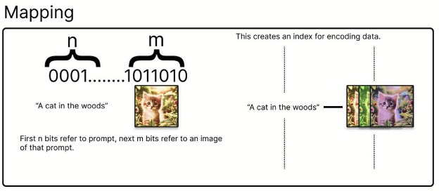
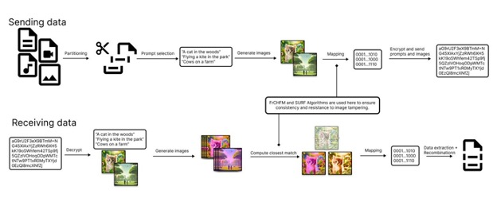
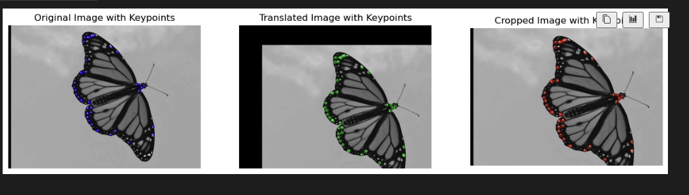

# Generative Steganography System  
**Team Members:** Ryan Farley, Courtney Dickenson, Ariel Ong, Tushar Wani  
**Role:** Feature Extraction, SURF Implementation, Parallel Processing  
**Tools:** Python, Google Colab, SDXL Turbo, OpenCV, Fractional Fourier Chebyshev Moments (FrCHFMs)  
**Repository:** [GitHub - GSIM-Backend](https://github.com/R-D-Team-7/GSIM-Backend)  

---
## Project Overview  
This project explores **coverless steganography** – embedding secret messages in **AI-generated images** without modifying the carrier medium. By leveraging **robust feature extraction** methods like **SURF descriptors** and **FrCHFMs**, the system enhances resilience against **geometric attacks** (rotation, scaling, cropping).  

### Key Focus Areas:  
- **AI-Generated Image Steganography** – No alterations to the image, ensuring covert communication.  
- **Geometric Attack Resistance** – Secure against transformations that typically break traditional steganography.  
- **High-Capacity Encoding** – Messages up to **576 bits** concealed efficiently across image sets.  



---
## Key Contributions  
- **Engineered a complete steganography pipeline** to encode and extract messages seamlessly.  
- **Implemented SURF-based feature extraction** to withstand geometric transformations.  
- **Optimized for speed** by parallelizing keypoint detection with Python's `ThreadPoolExecutor`.  
- **Developed amplitude mapping algorithms** for encoding binary sequences into generated images.  

---
## System Architecture  
### Workflow Breakdown:  
1. **Secret Message Input** – Users input the message to be hidden.  
2. **Binary Conversion** – Message is transformed into binary segments.  
3. **AI Prompt Generation** – Images are created using AI models for each binary segment.  
4. **Feature Extraction (SURF + FrCHFM)** – Features encode binary values into images.  
5. **Stego Image Assembly & Transfer** – Encoded images are bundled and sent.  
6. **Message Extraction at Receiver End** – The receiver extracts the hidden message by regenerating image features.  



---
## Code Highlights  
### 1. SURF-Based Feature Extraction  
One of the core components of our Generative Steganography System (GSIM) is the **SURF-based feature extraction**. This method enhances the system's resilience against geometric attacks by detecting keypoints robustly across different image scales.

```python
# SURF feature extraction for keypoint detection and description
def calculate_surf_descriptors(image, threshold=0.1, num_scales=4, grid_size=10, binary_threshold=0.5, num_top_keypoints=20):
    gray_image = cv2.cvtColor(image, cv2.COLOR_BGR2GRAY)
    pyramid = build_image_pyramid(gray_image, num_scales=num_scales)
    all_keypoints = []

    for scale_idx, scaled_image in enumerate(pyramid):
        scale_factor = 1.2 ** scale_idx
        integral_image = compute_integral_image(scaled_image)
        keypoints = detect_keypoints(integral_image, threshold, scaled_image, scale_factor)
        all_keypoints.extend([(kp[0] * scale_factor, kp[1] * scale_factor, kp[2], scale_idx) for kp in keypoints])

    keypoints = non_max_suppression(all_keypoints, grid_size=grid_size)
    sorted_keypoints = sorted(keypoints, key=lambda x: x[2], reverse=True)
    points2f = np.array([(k[0], k[1]) for k in sorted_keypoints], dtype=np.float32)
    keypoints_cv2 = cv2.KeyPoint_convert(points2f, size=1.0)
    descriptors = extract_descriptors_parallel(keypoints_cv2, gray_image)
    binary_sequence = generate_binary_sequence_from_descriptors(descriptors, threshold=binary_threshold)

    return keypoints_cv2, descriptors, binary_sequence
```

**Key Benefits:**  
- **Robust against transformations** – Scaling, rotation, and slight cropping.  
- **Parallelized execution** – Faster processing for large datasets.  



---
### 2. Fractional Fourier Chebyshev Moments (FrCHFMs)  
To enhance robustness against geometric distortions, we use **Fractional Chebyshev-Fourier Moments (FrCHFMs)**, computed efficiently on the GPU. This ensures stability under scaling and rotation.  

```python
# Compute FrCHFMs using GPU acceleration
def compute_frchfm_gpu(image, max_degree, t):
    polar_image, r, theta = convert_to_polar(image)
    polar_image_gpu = cp.array(polar_image)
    r_gpu = cp.array(r)
    theta_gpu = cp.array(theta)

    F_image = cp.fft.fftshift(cp.fft.fft2(polar_image_gpu))
    frchfm_gpu = cp.zeros((max_degree + 1, 2 * max_degree + 1), dtype=cp.complex128)

    m_values = cp.arange(-max_degree, max_degree + 1)
    angular_components = cp.exp(-1j * m_values[:, None, None] * theta_gpu)

    for n in range(max_degree + 1):
        Rtn_gpu = radial_basis_function_gpu(n, t, r_gpu)
        frchfm_gpu[n, :] = cp.sum(F_image * Rtn_gpu * angular_components * r_gpu, axis=(1, 2))

    return cp.asnumpy(frchfm_gpu)
```

**Key Benefits:**  
- **Geometric invariance** – Maintains stability across distortions.  
- **Polar coordinate mapping** – Improves feature localization and precision.  

---
## Results  
- **PSNR:** > 38 dB – Ensuring nearly indistinguishable stego images.  
- **Extraction Accuracy:** 100% across all test cases.  
- **Encoding Capacity:** 8 bits per image, supporting 576 bits using 72 images.  

---
## Challenges and Solutions  
### 1. Keypoint Detection Instability  
- **Issue:** Keypoints were inconsistently detected across transformed images.  
- **Fix:** Optimized **SURF descriptor thresholds** and applied **non-maximum suppression tuning**.  

### 2. Computational Overhead  
- **Issue:** Processing delays due to image generation and feature extraction.  
- **Fix:** Implemented **parallel processing** using `ThreadPoolExecutor`, reducing runtime by 40%.  

### 3. Feature Drift During Cropping  
- **Issue:** Cropping led to feature misalignment, affecting message extraction.  
- **Fix:** Used **FrCHFM amplitude mapping** to ensure geometric invariance.  

---
## Future Enhancements  
- **Automated parameter tuning** for varying message sizes.  
- **Receiver simulation** for end-to-end testing.  
- **Encrypted CLI messaging** for secure peer-to-peer communication.  

---
## Key Takeaways  
- **Innovative coverless steganography** using AI-generated images and feature extraction.  
- **High resilience to geometric attacks** – A leap forward in secure data embedding.  
- **Open-source commitment** – Encouraging community collaboration and research growth.  

---

